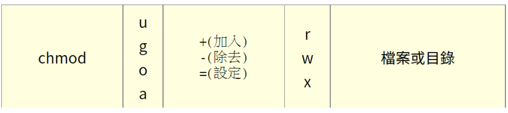

# Linux
## 終端介面
ctrl + alt + f2 ~ f6：切換終端機        
切換終端機像硬體部分可以共用，像是"檔案"，但輸入如history指令就不會共用相同歷史

## Linux 命令行
### Linux「命令行」由以下兩者組成：     
提示字元 (Shell prompt)：通常是 $ 或 #。

一般使用者：$       
管理員：#

### 指令本身：
ex: echo , ls ...

## linux 指令
指令由三者組成，用「空格」分開：        
+ command：指令名稱，ls、pwd、cd。
+ options：選項，用「-」或「--」開頭，例如 -a、--all。      
(-a會是縮寫 --則是全名，也可以-al這樣合在一起就會是等於-a -l)
+ arguments：參數，指令的對象，例如 /opt。

EX. echo -e "1\n2\n3" 出來會是
1
2
3

### 快捷鍵:
Tab：自動補齊檔案 or 指令(bash shell)       
Ctrl + c：中斷目前執行的指令        
Ctrl + d：結束 shell        
Ctrl + l：清除畫面      
Ctrl + a：游標移到行首      
Ctrl + e：游標移到行尾      
Ctrl + u：刪除游標前的字元      
Ctrl + k：刪除游標後的字元      
Ctrl + r：搜尋歷史指令      
Alt + .：重複上一個指令的最後一個 argument (建議多試幾次來理解)     
page up / page down：上下翻之前執行的指令 

## 忘記指令怎麼辦？
用man

EX. man ls

或是        
-h、--help
EX:     
ls -h       
ls --help

### chgrp：改變檔案所屬群組
語法：
chgrp [-R] <group-name> <file/dir>            
-R：遞迴變更，即連同次目錄底下所有檔案、目錄都更新群組

### chown：改變檔案擁有者

事實上，chown也可以使用『chown user.group file』來同時修改 user 和 group，(在擁有者與群組間加上小數點『 . 』，      
不過建議使用冒號『:』來隔開擁有者與群組，因為怕有.開頭的 user 或 group)： 

ex:touch test.txt
chown sysop:sysop test.txt      
(把 test.txt 的擁有者改成 sysop，群組也改成 sysop)

### chmod：改變檔案權限
兩種設定方式：

+ 數字法：r=4, w=2, x=1
+ 符號法     
   
+,- 沒有指定權限的不變      
= 沒有指定的權限會消失      

### ex:     
範例：設定一個檔案的權限成為『-rwxr-xr-x』  
touch chmod.txt     
chmod a=rwx,go=rx chmod.txt     

範例：不知原先的檔案屬性，只想要增加每個人均可寫入的權限
chmod a+w chmod.txt     

範例：將權限去掉而不更動其他已存在的權限呢？例如要拿掉全部人的可執行權限
chmod a-x chmod.txt
## history 會出來123
只要ex. !1就會執行1的指令

# 自我補充:  
Bin裡面有存放shell指令
Alias xxx自訂指令     
預設的ln就是硬連結